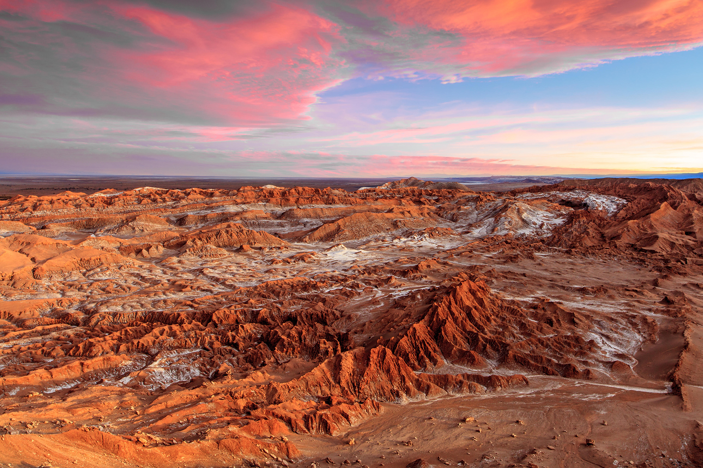
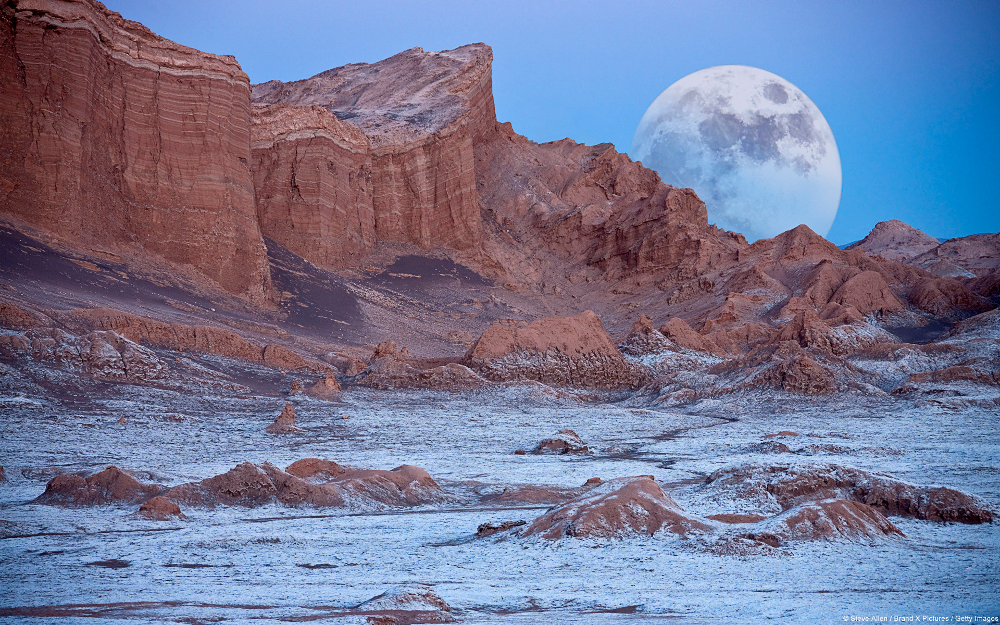

# Grace Gilbert (gracegi)

## Demo Link

## External Resources
I used the following source to help calculate the gradient of my height map terrain:

When you run the program, you should see this scene:

## Inspiration and Reference Images
I was largely inspired by the Atacama Desert in Chile. I like how the mountains vary, ranging from flatter plateaus to pointed peaks. I also particularly liked the contrast of having the icy salt on the lower elevation flats, rather than the typical snow at the peaks of the mountains. These features of the desert, along with others, are ones I tried to incorperate into my terrain:

## Implementation

## Submission
Commit and push to Github, then submit a link to your commit on Canvas. Remember
to make your own README!

## Extra Credit (20 points maximum)
- __(5 - 20 pts)__ Modify the flat shader to create a procedural background for
your scene. Add clouds, a sun (or suns!), stars, a moon, sentient nebulae,
whatever tickles your fancy! The more interesting your sky, the more points
you'll earn!
- __(5 - 10 pts)__ Use a 4D noise function to modify the terrain over time, where time is the
fourth dimension that is updated each frame. A 3D function will work, too, but
the change in noise will look more "directional" than if you use 4D.
- __(10 - 20 pts)__ Create your own mesh objects and procedurally place them
in your environment according to terrain type, e.g. trees, buildings, animals.
- __(10 - 20 pts)__ Cast a ray from your mouse and perform an action to modify the terrain (height or color), making your environment paintable.
- __(? pts)__ Propose an extra feature of your own!
