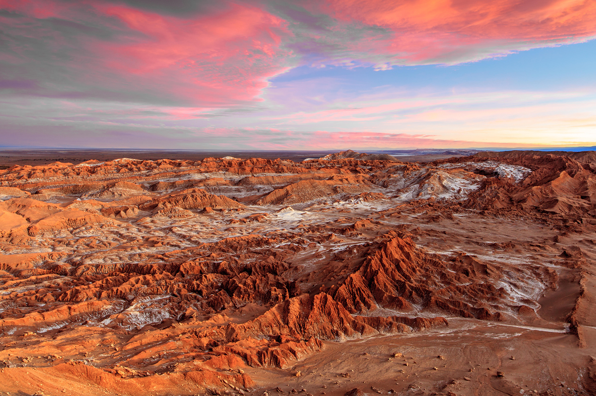

# Grace Gilbert (gracegi)

## Demo Link

## External Resources
I used the following source to help calculate the gradient of my height map terrain:

## Inspiration and Reference Images
I was largely inspired by the Atacama Desert in Chile. I like how the mountains vary, ranging from flatter plateaus to pointed peaks. I also particularly liked the contrast of having the icy salt on the lower elevation flats, rather than the typical snow at the peaks of the mountains. These features of the desert, along with others, are ones I tried to incorperate into my terrain:

## Implementation
### Height Map
I combined three noise functions to create the height map of the terrain. The combination of these three noise functions helped me achieve the terrain variety I liked in the Atacama Desert. 
- For the sharper peaks, I used a simple FBM and raised the output value to the 8th power to get steeper slopes and flatter flats.  
- For the plateau heightmap and placement, I used a Worley Noise based FBM at a larger scale. The Worley Noise helped create natural looking pockets of flatter land surrounded by the plateaus. 
- To flatten the tops of the plateaus, I bound the height map by a maximum height. I generated this maximum height using pure Worley Noise, which created a smooth, subtly rounded surface at the tops of the plateaus rather than a flat plane. The user can adjust the scale of the Worley Noise maximum height to raise and lower the plateaus. 

INSERT IMAGE OF HEIGHTMAP AND TERRAIN AT TWO DIFFERENT HEIGHTS

### Ground Texture
For the ground texture, I created various textures and then used maps to combine them. 
- The base material is the red earth texture. To make this, I have a red color that is darkened in areas using FBM. I also used the inverses of two frequencies of Worley based FBM to create the crackly pattern in the earth. This pattern is scaled by the gradient so that it only appears on flatter areas. To create striations in on the steeper slopes of the terrain, I layered two general patterns. One is a 3-dimensional FBM that is scaled down along Y to create horizontal striations in the terrain. The other is a combination of sine curves offset by FBM that influence the color, adding saturation, as well as some blues and greens to the striations of the terrain.  

- Layered on top of the red texture is a dusty, dark gray green tone. This texture is masked by an FBM, as well as the elevation and gradient of the terrain. The result is that the dark gray appears towards the tops of the plateaus as well as in flatter areas along the sides of mountains, creating a natural color shift on the elevated terrain. 

- Finally, I added salt to the flatter parts of the lower elevation terrain. The salt is placed on a macro scale using an FBM map that is elongated in X to create a striped pattern of sand. On the micro level, there are subtle cracks and spots in the sand to make it feel grainy. 

The entire terrain is shaded with lambertion shading, which uses normals calculated from the gradient of the height map. Additionally, I applied distance fog towards the edge of the terrain, blending into the purple of the sky. 

### Sky
To create the sky, I mapped the 2-dimensional screenspace of the back rectangle to a sphere surroudning the camera. Within this spherical space, I used various functions to create the sky texture and the moon.
- To create the sky, interpolated between a color palette, going from dark purple up to icy blue. The blending of these colors uses a 3-dimensional worley based FBM, creating a cloudy feel. For the sky, I scaled down the screen space in the y direction in order to flatten out the FBM pattern. this make the clouds look elongated.
- 

